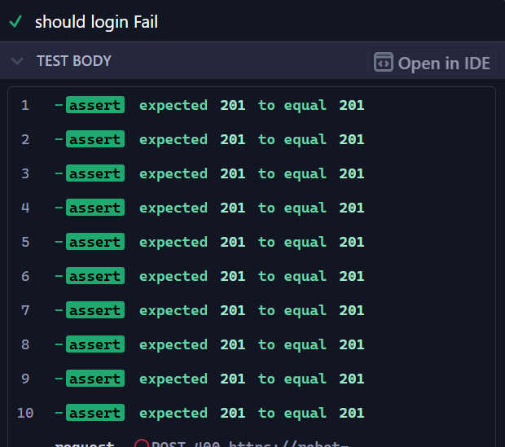

## ผลการทดสอบ API request 10 รอบกับ register

โดยทางผมจะคาดหวังให้เป็น 400 เนื่องจาก user already exists
ผลลัพธ์คือ
[]

## การสร้าง user จำนวน 10 user (10 email) และ save ข้อมุลไปที่ไฟล์ intercepted_post-register-success.json

```javascript
it.only("should Register Successfully", () => {
  let interceptedData = [];

  for (let i = 0; i < 10; i++) {
    interceptedData = interceptTest(interceptedData);

    cy.visit(URL);
    cy.get(".logo").should("have.text", webTitle);
    cy.wait(timeSleep);
    cy.get(registerButton).click();
    cy.wait(timeSleep);
    cy.get(registerFirstname).type(regisFirstname);
    cy.wait(timeSleep);
    cy.get(registerLastname).type(regisLastname);
    cy.wait(timeSleep);
    regisEmail = regisEmail.slice(0, 4) + i + regisEmail.slice(4);
    cy.get(registerEmail).type(regisEmail);
    cy.wait(timeSleep);
    cy.get(registerPassword).type(regisPassword);
    cy.wait(timeSleep);
    cy.get(formButton).click({ force: true });

    cy.get(".message")
      .invoke("text")
      .then((text) => {
        cy.log(text);

        if (text === registerSucessMessage + userName + "!") {
          cy.screenshot("register/register-success.png");
          saveInterceptedData(interceptedData, "register-success", true);
        } else if (text === registerErrorMessage) {
          cy.screenshot("register/register-fail.png");
          saveInterceptedData(interceptedData, "register-fail", false);
        } else {
          cy.screenshot("register/register-unknown.png");
          saveInterceptedData(interceptedData, "register-unknown", false);
        }
      });

    saveInterceptedData(interceptedData, "register", true);
  }
});
```
